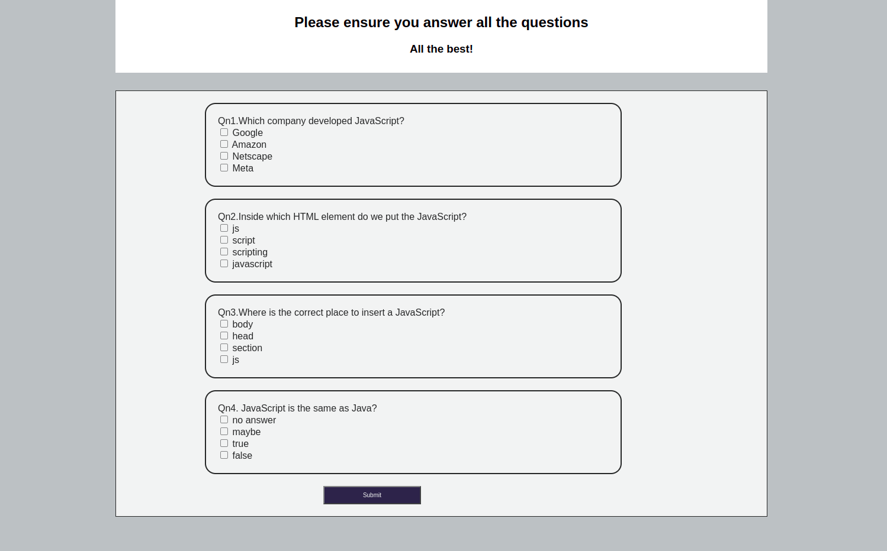

# Quiz Board
 ## By Valentine Maiyo
## Screenshot
 
 ## Table of Content
 - [Description](#description)
 - [Features](#features)
 - [Behaviour Driven Development](#Behaviour-Driven-Development)
 - [Requirements](#requirements)
 - [Installation Process](#installation-Process)
 - [Live Link](#Live-Link)
 - [Technology  Used](#technology-Used)
 - [Licence](#licence)
 - [Authors Info](#Authors-Info)
 ## Description
The Quiz Board is intended for students to take Javascript examinations to assess their understanding of Javascript concepts, but it can also be used to evaluate concepts in other languages.
 ###  Features

 * User get access to quiz box 
 * Start the quiz by clicking a start button
 * Users Checks the correct answers and submits
 * Users can get their resuts on a board and can retake if they fail

 ### Behaviour Driven Development|

| Behaviour                                   |           Input                      | Output                   |
| --------------------------------           | :----------------------------------- | :------------------------|
| Is used Tests whether the user has 
  understood javascript concepts              |   Enter Name                         |take you to start page
|                                             | if all questions are correct         | Your have scorerd 100 out of 100 |
|                                             |                                      |                                  |
|                                             | Score is 80 -100                     | Passed Excellently       |
|                                             | Score is 50- 79                      |  Fairly Passed          |
|                                             | Score is 0- 49                       |  retake test         |

 ###  Requirements
 * Access to  a laptop or a phone or a desktop computer
 * Access to internet
 ### Installation Process
* clone or Download the repo.
* Unzip the downloaded Folder.
* open the folder in an editor of choice.
* run the index.html file.

### Live Link

### Technology  Used
* HTML - which was used to develope the structure off the pages.
* CSS - which was used to style the User Interface.
* Javascript - Used to add interactive behaviour to the page.

## Known Bugs
* There are currently no bugs
## Licence
MIT License

Copyright (c) 2022 Valentine Maiyo

Permission is hereby granted, free of charge, to any person obtaining a copy
of this software and associated documentation files (the "Software"), to deal
in the Software without restriction, including without limitation the rights
to use, copy, modify, merge, publish, distribute, sublicense, and/or sell
copies of the Software, and to permit persons to whom the Software is
furnished to do so, subject to the following conditions:

The above copyright notice and this permission notice shall be included in all
copies or substantial portions of the Software.

THE SOFTWARE IS PROVIDED "AS IS", WITHOUT WARRANTY OF ANY KIND, EXPRESS OR
IMPLIED, INCLUDING BUT NOT LIMITED TO THE WARRANTIES OF MERCHANTABILITY,
FITNESS FOR A PARTICULAR PURPOSE AND NONINFRINGEMENT. IN NO EVENT SHALL THE
AUTHORS OR COPYRIGHT HOLDERS BE LIABLE FOR ANY CLAIM, DAMAGES OR OTHER
LIABILITY, WHETHER IN AN ACTION OF CONTRACT, TORT OR OTHERWISE, ARISING FROM,
OUT OF OR IN CONNECTION WITH THE SOFTWARE OR THE USE OR OTHER DEALINGS IN THE
SOFTWARE.
## Authors Info
Email- maiyoj12@gmail.com

[Go Back to the top](#)
